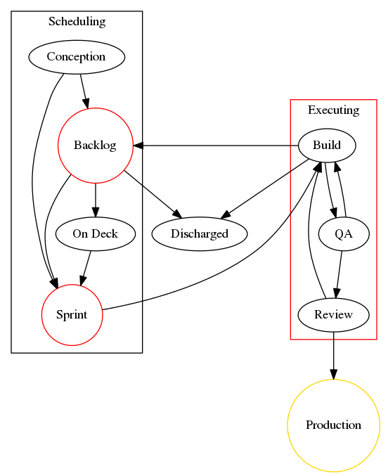
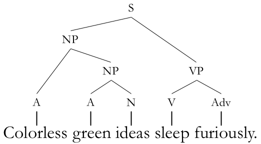
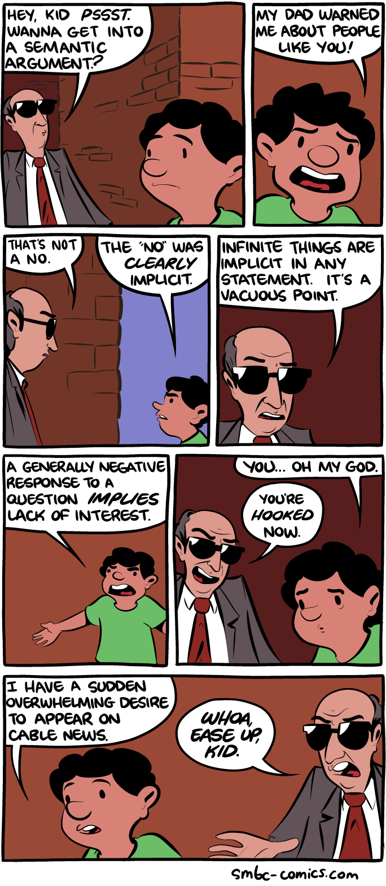

~~What is a JIRA and how do I get one?~~

## Overview

-   The Watcher

-   Basic workflow

-   Syntax Party

-   Food || Questions

-   Integration and reuse

-   Gotchas

-   Useful Queries

## The Watcher

Don't measure what you don't want to optimize.

Automation can help.

## Workflow as seen on JIRA

## Syntax and Semantics

### Don't Panic

## Operators

Logical

-   AND

-   OR

-   NOT

Conditional

-   =

-   !=

-   ~

-   is

-   is not

-   in

-   not in

## Algebra all over again

Which are the same?

A AND B OR C

A AND (B OR C)

(A AND B) OR C

Don't guess! Just include parens all the time.

## Fields and Values

project = Android OR project = iOS

project in (Android, iOS) AND type = Bug

(project != ATEAM) AND (text ~ Drawing) AND resolved is EMPTY

## Food and Questions Break

## Integration and reuse

-   Filters

-   Boards

-   Quick Filters

-   Sharing

-   Saving

-   Webhooks!

### Gotchas

-   Dates are goofy

-   Editing a saved filter is dangerous

-   Two types of sharing

-   Different teams, different states

-   Absolute truth and duplication

### Useful Queries

Intentionally left blank. Show and tell.
